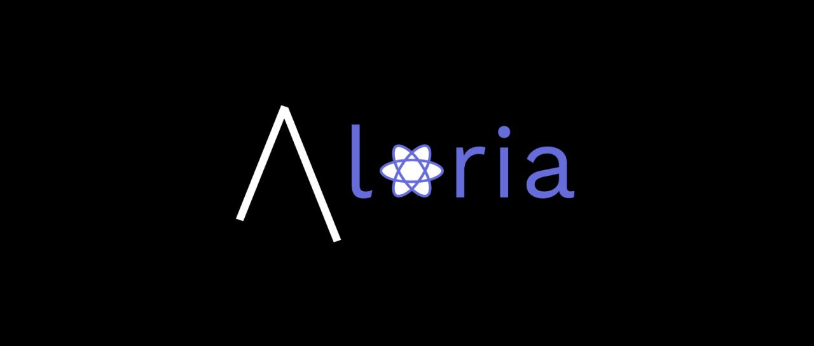

# Aloria UI



## Intro

<p>Aloria UI is a bootstrap-like react library to assist with developers. It contains reuasable react components and hooks, fonts, icons, and more.</p>

[](https://www.npmjs.com/package/aloria-ui) [](https://standardjs.com)

## Features

<ul>

<li>

Pre-built Components

</li>

<li>

Pre-built Hooks

</li>

<li>

Reusable Classnames

</li>

<li>

Responsive Image Component

</li>

<li>

Pre-built Video Player (under-construction)

</li>

<li>

Responsive Components

</li>

<li>

Highly Customisable

</li>

</ul>

## Install

```bash
npm install aloria-ui
```

or...

```bash
yarn add aloria-ui
```

## Usage

### Components

<p>These are the available components:</p>

<ul>

<li>

[`Button`](./src/components/Button)

</li>

<li>

[`Card`](./src/components/Card)

</li>

<li>

[`Container`](./src/components/Container)

</li>

<li>

[`Form`](./src/components/Form)

</li>

<li>

[`Input`](./src/components/Input)

</li>

<li>

[`Label`](./src/components/Label)

</li>

<li>

[`Grid`](./src/components/Grid)

</li>

<li>

[`Image`](./src/components/Image)

</li>

<li>

[`ScrollableDiv`](./src/components/ScrollableDiv)

</li>

</ul>

### Hooks

<p>These are the available hooks:</p>

<ul>

<li>

[`useLoading`](./src/hooks/useLoading)

</li>

</ul>

### ClassNames

<p>

The classnames let you use certain style properties of Aloria UI components, in case you don't want to import the whole component.

</p>

<p>

Check out all classnames in [here](./src/classnames).

</p>

### Importing/Using

```jsx
import React from "react";
import { MyComponent } from "aloria-ui";

export default function App() {
  return <MyComponent />;
}
```

<p>

Change the `MyComponent` with whichever component or hook you wish.

</p>

## Contribute

<p>To contribute to the project, check out the templates directory.</p>

## License

MIT © [Avi Avinav](https://github.com/AviAvinav)
