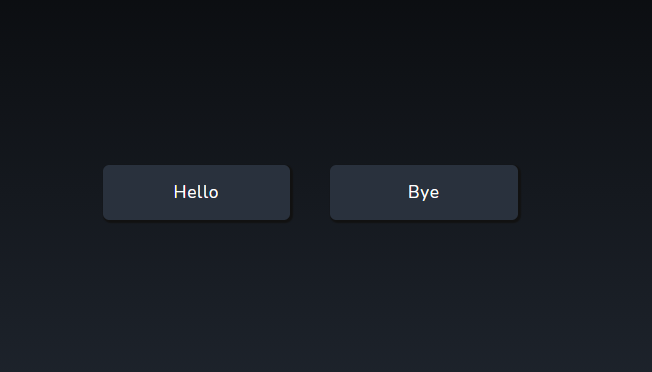

# Button

<p>Simple button component</p>

## Usage

```jsx
import React from "react";
import { Button } from "aloria-ui";

export default function App() {
  return <Button>Hello</Button>;
}
```

## Props

<p>

The ComponentName component takes the following props:

<ul>

<li>

`btnColor`: It specifies the background color of the button. Default value: `#29313D` .

</li>

<li>

`btnHoverColor`: It specifies the background color of the button on hover. Default value: `#222322` .

</li>

<li>

`btnShadow`: It specifies the box shadow color of the button. Default value: `#111111` .

</li>

<li>

`borderRadius`: It specifies the border radius of the button. Default value: `5px` .

</li>

<li>

`width`: It specifies the width of the button. Default value: `150px` .

</li>

<li>

`textColor`: It specifies the font color of the button. Default value: `#ffffff` .

</li>

<li>

`onClick`: It specifies the onClick function of the button.

</li>

</ul>

</p>

## Preview/Example

<p>Here is an example of how to use the ComponentName component.</p>

```jsx
import React, { useState } from "react";
import { Button } from "aloria-ui";

export default function App() {
  const [value, setValue] = useState("Hello");
  const setChange = () => {
    setValue(value === "Hello" ? "Bye" : "Hello");
  };
  return (
    <>
      <Button>Hello</Button>
      <Button onClick={() => setChange()}>{value}</Button>
    </>
  );
}
```

<br/>

<p>The button on the right has been clicked.</p>

<div style="display: flex; justify-content: center;" >

</div>
