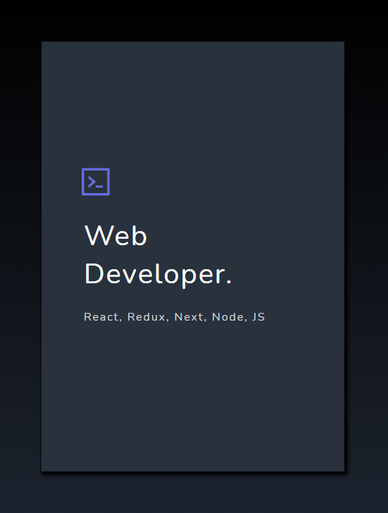

# Card

<p>The card is a simple component with a header label and logo.</p>

## Usage

```jsx
import React from "react";
import { Card } from "aloria-ui";

export default function App() {
  return <Card />;
}
```

## Props

<p>

The card component takes the following props:

<ul>

<li>

`cardColor`: It determines the background color of the card component. Default value: "#29313D".

</li>

<li>

`cardShadow`: It determines the box shadow color of the card component. Default value: "#000000".

</li>

<li>

`icon`: It determines the icon to be used in the card component. Default value: `<AiOutlineCode />` from react-icons.

</li>

<li>

`headerText`: It determines the text of the header of the card component. Default value: "Lorem Ipsum".

</li>

<li>

`headerTextColor`: It determines the color of header text of the card component. Default value: "#FFFFFF".

</li>

<li>

`labelText`: It determines the text of the label of the card component. Default value: "Lorem Ipsum Dorsetta".

</li>

<li>

`labelTextColor`: It determines the color of the label text of the card component. Default value: "#D1D1D1".

</li>

</ul>

</p>

## Preview/Example

<p>Here is an example of how to use the card component.</p>

```jsx
import React from "react";
import { Card } from "aloria-ui";

export default function App() {
  return (
    <Card
      headerText="Web Developer."
      labelText="React, Redux, Next, Node, JS"
    />
  );
}
```

<br/>

<div style="display: flex; justify-content: center;" >

</div>
