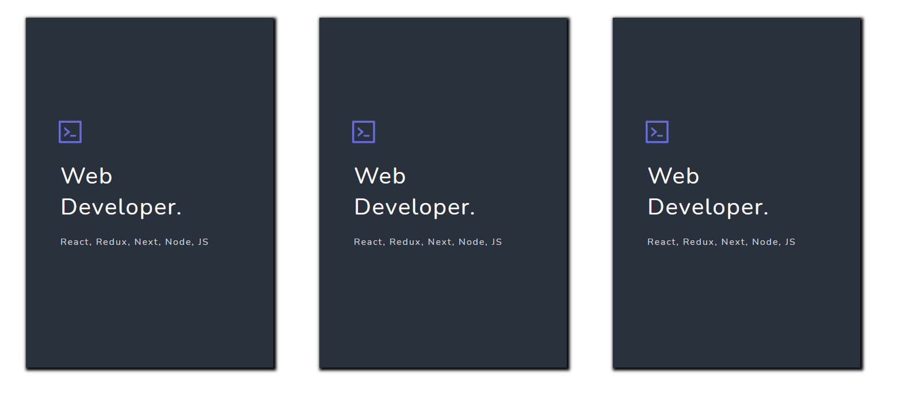

# Container

<p>

Container is a basic flex container component.

</p>

## Usage

```jsx
import React from "react";
import { Container } from "aloria-ui";

export default function App() {
  return <Container />;
}
```

## Props

<p>

The Container component takes the following props:

<ul>

<li>

`flexDirection`: It specifies the flex direction of the container. Default value: for screen-widths >= 1000px, `row`; otherwise, `column`.

</li>

<li>

`alignItems`: It specifies the alignment of items (vertically) of the container. Default value: `center`.

</li>

<li>

`justifyContent`: It specifies the alignment of items (horizontally) of the container. Default value: `space-between`.

</li>

<li>

`className`: It specifies the className you want to add to the component to style it yourself.

</li>

</ul>

</p>

## Preview/Example

<p>Here is an example of how to use the Container component.</p>

```jsx
import React from "react";
import { Container } from "aloria-ui";

export default function App() {
  return (
    <Container>
      <Card
        headerText="Web Developer."
        labelText="React, Redux, Next, Node, JS"
      />
      <Card
        headerText="Web Developer."
        labelText="React, Redux, Next, Node, JS"
      />
      <Card
        headerText="Web Developer."
        labelText="React, Redux, Next, Node, JS"
      />
    </Container>
  );
}
```

<br/>

<div style="display: flex; justify-content: center;" >

</div>
