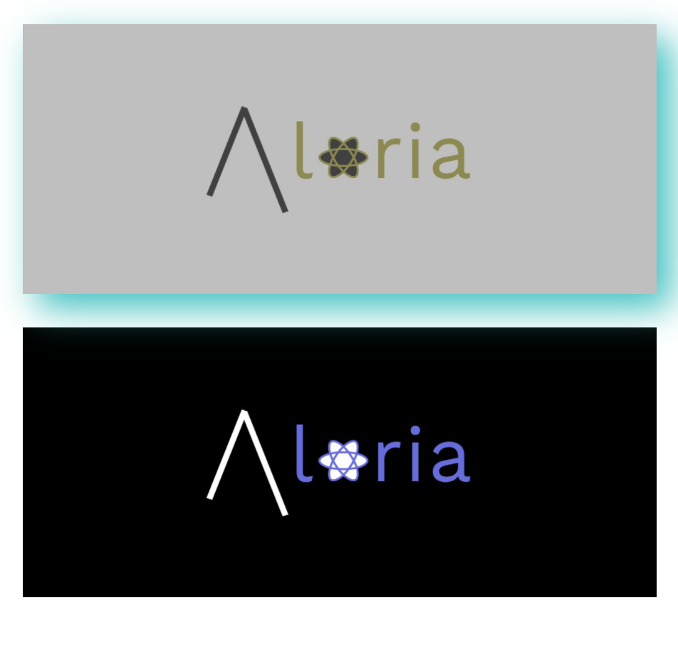

# Image

<p>The "Image" component is a component that can be used for responsive lazy loading images. It also offers a variety of filters.</p>

## Usage

```jsx
import React from "react";
import { Image } from "aloria-ui";

export default function App() {
  return <Image />;
}
```

## Props

<p>

The Image component takes the following props:

<ul>

<li>

`src`: Specifies the source of the file (image). This is a required prop.

</li>

<li>

`alt`: Specifies the alt attribute (text to be shown if image fails to load) of image. This is an optional prop.

</li>

<li>

`width`: Specifies the custom width of the image. This is an optional prop.

</li>

<li>

`height`: Specifies the custom height of the image. This is an optional prop.

</li>

<li>

`filter`: Specifies the type of filter for the image. This is an optional prop. Available filters:

<ol>

<li>blur</li>
<li>hue</li>
<li>drop-shadow</li>
<li>cool-drop-shadow</li>
<li>grayscale</li>
<li>contrast</li>

</ol>

</li>

</ul>

</p>

## Preview/Example

<p>Here is an example of how to use the Image component.</p>

```jsx
import React from "react";
import { Image } from "aloria-ui";

export default function App() {
  return (
    <>
      <Image src="../../media/aloria.png" filter="cool-drop-shadow" />
      <Image src="../../media/aloria.png" />
    </>
  );
}
```

<br/>

<div style="display: flex; justify-content: center;" >

</div>
