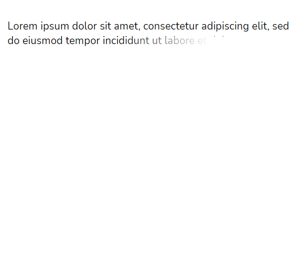

# Truncate

<p>Truncate component is a wrapper which can truncate you text</p>

## Usage

```jsx
import { Truncate } from "aloria-ui";

export default function App() {
  return (
    <Truncate>
      {/* You can use p, h1, h2, h3, h4, h5, h6 */}
      <p>{/* Some text here */}</p>
    </Truncate>
  );
}
```

## Props

<p>

The Truncate component takes the following props:

<ul>

<li>

`className`: Use it to pass your own styles.

</li>

</ul>

</p>

## Preview/Example

<p>Here is an example of how to use the ComponentName component.</p>

```jsx
import { Truncate } from "aloria-ui";

export default function App() {
  return (
    <Truncate>
      <p>
        "Lorem ipsum dolor sit amet, consectetur adipiscing elit, sed do eiusmod
        tempor incididunt ut labore et dolore magna aliqua. Ut enim ad minim
        veniam, quis nostrud exercitation ullamco laboris nisi ut aliquip ex ea
        commodo consequat. Duis aute irure dolor in reprehenderit in voluptate
        velit esse cillum dolore eu fugiat nulla pariatur. Excepteur sint
        occaecat cupidatat non proident, sunt in culpa qui officia deserunt
        mollit anim id est laborum."
      </p>
    </Truncate>
  );
}
```

<br/>

<div style="display: flex; justify-content: center;" >

</div>
