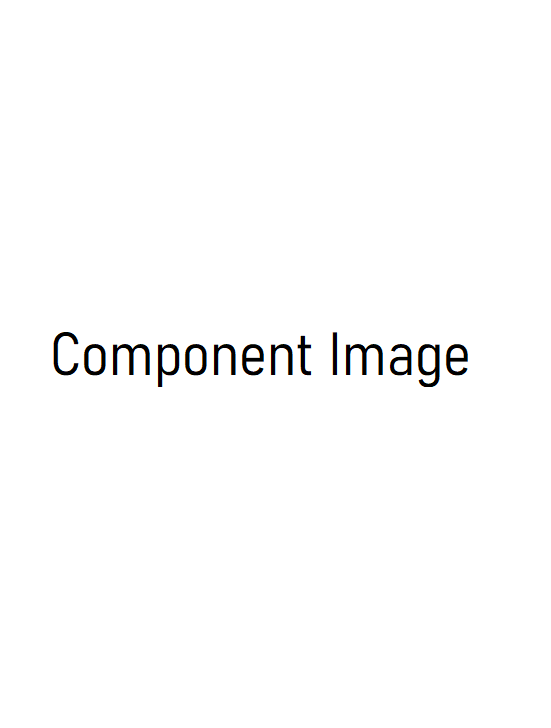

# ComponentName

<p>Component Description</p>

## Usage

```jsx
import React from "react";
import { ComponentName } from "aloria-ui";

export default function App() {
  return <ComponentName />;
}
```

## Props

<p>

The ComponentName component takes the following props:

<ul>

<li>

`componentProps`: prop description

</li>

</ul>

</p>

## Preview/Example

<p>Here is an example of how to use the ComponentName component.</p>

```jsx
import React from "react";
import { ComponentName } from "aloria-ui";

export default function App() {
  return <ComponentName componentProps={} />;
}
```

<br/>

<div style="display: flex; justify-content: center;" >

</div>
